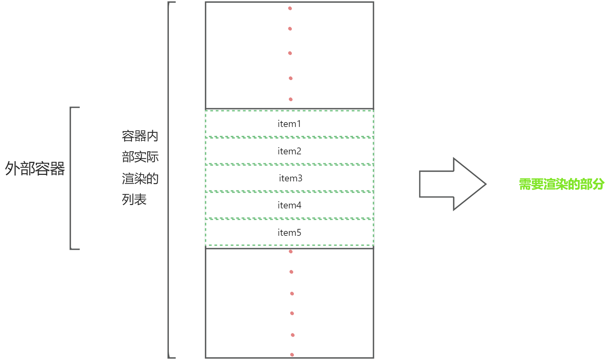
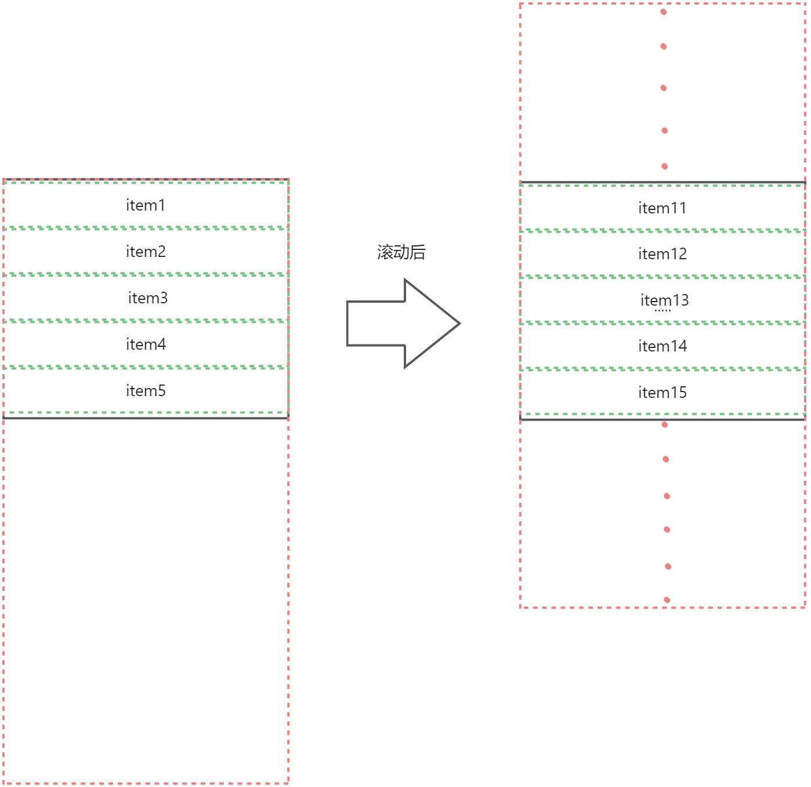
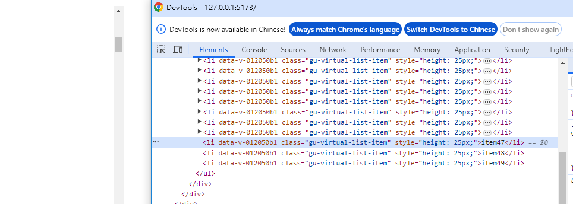
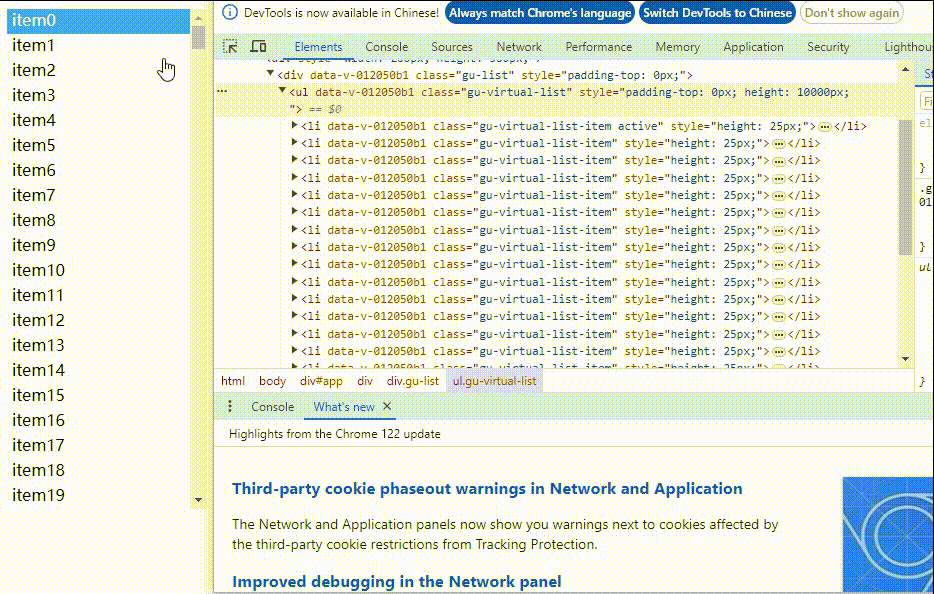

工作中经常遇到大数据量导致页面卡顿的问题。为了改善用户体验，通常会采用虚拟列表进行渲染优化。现在我将简要介绍两种虚拟列表的实现方法。
#### 原理
虚拟列表的核心原理是仅渲染用户可见的部分，从而减少DOM渲染的时间和DOM数量，避免页面卡顿。通过以下图示可以明确，只需渲染可视区域（绿色框线）内的DOM元素即可
:::info
为了方便描述，外部容器统称为Container,内部列表称为List。
:::

#### 子项固定高度的虚拟列表
首先，要实现上图中的Container和List，需要确保List具有固定的高度并且支持纵向滚动。List的初始高度可以通过数据量乘以每个子项的高度（itemHeight）来计算得出。考虑到数据量很大，因此List的高度会超过Container的高度，而用户每次只能通过Container看到List的一部分内容。值得注意的是，这里假设每个子项的高度是固定的。
其次，我们需要考虑如何计算要展示的索引，以确保每次滚动后都能正确展示对应的虚拟列表值。
经过思考，我们发现Container的scrollTop属性就是List滚动后可视区域上部的高度。因此，可视区域第一个要展示的元素索引可以通过计算startIndex = Math.floor(Container.scrollTop / itemHeight)得到。接着，我们可以通过Container的高度计算出需要展示多少个元素，即len = Math.ceil(Container.height / itemHeight)。最后，可以通过计算endIndex = startIndex + len来确定需要渲染的数据范围，即[startIndex, endIndex]。将这段数据渲染到页面上。
然而，当我们满怀信心地打开页面后，发现滚动后的展示区域是空白的...这让我们陷入困惑。

此时我们注意到，由于List的高度是与整个数据对应的高度相等，当前数据对应的区域被渲染在List容器的最上部。然而，由于Container的滚动区域只能看到Container内的内容，我们需要确保List内容的最上部一直在Container的可视区域内。为了实现这一点，我们可以给List设置相应的paddingTop值。
具体而言，当paddingTop的值等于Container的scrollTop，且List的高度等于总高度减去Container的scrollTop时，我们就可以确保List的内容区域始终在可视区域内。通过这种方式，我们已经完成了主要任务。现在，让我们看一下最终的结果。

#### GuVirtualList组件源代码
```vue
<template>
  <div
    ref="guList"
    class="gu-list"
    @scroll="onScroll"
  >
    <ul
      ref="virtualList" 
      class="gu-virtual-list"
      :style="{
        paddingTop:paddingTop + 'px',
        height:ListHeight + 'px'
      }"
    >
      <li
        v-for="item in showList"
        :key="item[field.key]"
        class="gu-virtual-list-item"
        :class="active == item[field.value] ? 'active' :''"
        :style="{
          height:itemHeight + 'px'
        }"
        @click="onClick(item)"
      >
        <slot
          name="content"
          :item="item"
        >
          {{ item[field.label] }}
        </slot>
      </li>
    </ul>
  </div>
</template>

<script lang='ts' setup name="GuVirtualList">
import { toRefs, ref, computed, onMounted } from 'vue'
import { Obj } from '../../types/utilsType'

export type ReplaceFieldType = {
  children?:string,
  value?:string,
  label?:string,
  key?:string,
  [field:string]:any
} 
interface VirtualProps {
  itemHeight?:number,
  list:Obj[],
  replaceField?: ReplaceFieldType
}
const defaultField = {
  children: 'children',
  value: 'value',
  label: 'label',
  key: 'key',
}
const props = withDefaults(defineProps<VirtualProps>(), {
  itemHeight: 25,
  list: () => ([]),
  replaceField: () => ({
    children: 'children',
    value: 'value',
    label: 'label',
    key: 'key',
  }),
})
const { itemHeight, list, replaceField: propField } = toRefs(props)
const ListHeight = computed(() => itemHeight.value * list.value.length - paddingTop.value)

const field = computed(() => ({
  ...defaultField,
  ...propField.value,
}))

const active = ref('')
const emits = defineEmits(['onClickItem'])
const onClick = (item:Obj) => {
  active.value = item[field.value.value]
  emits('onClickItem', item)
}
// 展示列表data
const showList = ref<Obj[]>([])
const guList = ref()
// 裁剪数组开始项
const startIndex = ref(0)
// 裁剪数组结束项
const endIndex = ref(0)
// 计算需要展示的元素个数
const needShowLength = ref(0)
// 容器的paddingTop随动
const paddingTop = ref(0)
const timer = ref(0)
const virtualList = ref()
const onScroll = () => {
  const { height } = guList.value.getBoundingClientRect()
  paddingTop.value = guList.value.scrollTop
  guList.value.style.paddingTop = paddingTop.value
  needShowLength.value = Math.ceil(height / itemHeight.value)
  startIndex.value = Math.floor((paddingTop.value) / itemHeight.value)
  endIndex.value = startIndex.value + needShowLength.value
  if (endIndex.value >= list.value.length) {
    endIndex.value = list.value.length
    guList.value.scrollTop = itemHeight.value * list.value.length - height
    let diff = needShowLength.value * itemHeight.value - height
    paddingTop.value = itemHeight.value * list.value.length - height - diff
    startIndex.value = endIndex.value - needShowLength.value
  }
  showList.value = list.value.slice(startIndex.value, endIndex.value)
}
const rsOb = new ResizeObserver((() => {
  if (timer.value) clearTimeout(timer.value)
  timer.value = window.setTimeout(() => {
    onScroll()
  }, 50)
}))
onMounted(() => {
  onScroll()
  rsOb.observe(guList.value)
})
</script>
<style scoped lang='scss'>
.gu-list{
  width: 100%;
  height: 100%;
  overflow-y:auto ;
  .gu-virtual-list{
    padding: 0;
    margin: 0;
    .gu-virtual-list-item{
      list-style: none;
      cursor: pointer;
      padding: 0px 5px;
      &.active{
        background: rgba(24,144,255,.8);
        color: #fff;
      }
    }
  }
}
</style>
```
#### 
