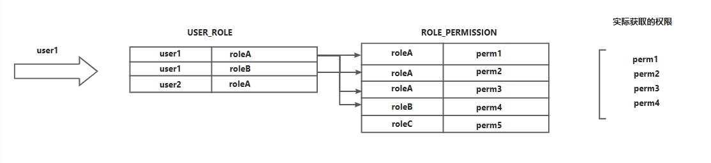
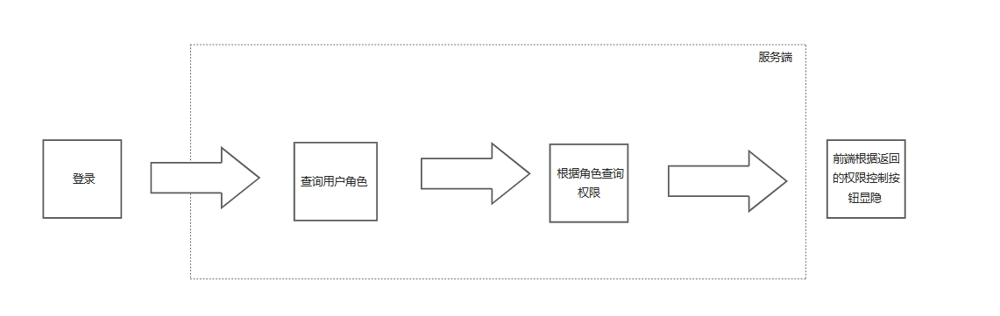
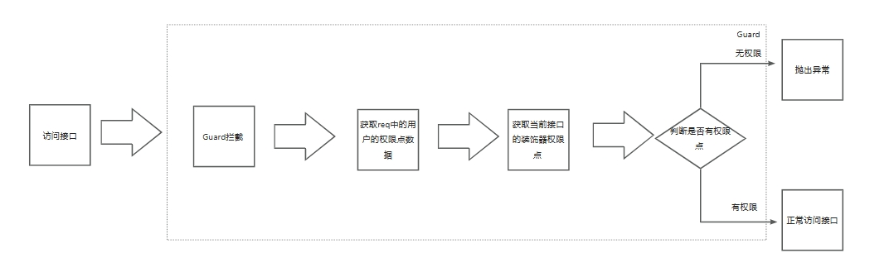

### `RBAC`权限模型简介
`RBAC`（基于角色的访问控制）是一种权限管理模型，通过将用户分配到不同的角色来控制他们在系统中的访问权限。每个角色代表一组特定的权限，用户通过其角色来获得执行某些操作的能力。比如，一个管理员角色可能拥有添加、删除用户的权限，而普通用户角色则只能查看信息。通过这种方式，`RBAC` 简化了权限管理，使得对用户权限的分配和调整更为高效和安全，特别适合复杂的系统和组织环境。
### 实现
通俗来讲，对一个用户来说分配不同的角色可以使其获得不同的能力。
#### 创建表
根据`RBAC`权限模型的概念，我们需要以下几张表
1. `USER`表，存储用户的基本信息。
2. `USER_ROLE`表（用户角色关联表），存储用户Id和用户对应的角色表的id，一个用户可分配多个角色（一对多）
3. `ROLE`表（角色表），存储角色基本信息。
4. `MENU`表（菜单及权限点表），存储菜单信息及菜单下的权限点信息。
5. `ROLE_PERMISSION`表（角色权限点关联表），存储角色对应的权限，一个角色可以分配多个权限点（一对多）
#### 权限查询
当用户登录后，根据用户的`userId`在`USER_ROLE`表中查询用户所有角色,根据角色的`roleId`查询所有的权限点。

具体流程如下:


#### 服务端权限控制
根据上述流程，我们已经初步实现了权限控制。然而，仅仅在前端控制按钮的显隐显然不够，我们还需要在服务器端进行权限控制，以确保系统的安全性和完整性。
`Nestjs`的`Guard`和`Decorators`可以帮助我们做到这一点，`Guard`是一个守卫，类似于前端的守卫，在请求到达路由处理程序之前，Guard可以对请求进行拦截，并根据特定条件允许或拒绝请求。而`Decorators`装饰器是一种特殊类型的声明，可以附加在类、方法、访问器、属性或参数上，我们需要自定义一个装饰器将当前的权限点附加在对应的`Controller`上。
实际流程如下

### 代码
#### 权限守卫（permission guard）
```typescript
import {
  CanActivate,
  ExecutionContext,
  Injectable,
  HttpException,
  HttpStatus,
} from '@nestjs/common';

import { Reflector } from '@nestjs/core';
import { AuthEnum } from 'src/common/enum';
import { RedisService } from 'src/modules/redis/redis.service';

@Injectable()
export class PermissionGuard implements CanActivate {
  constructor(
    private reflector: Reflector,
  ) {}
  async canActivate(context: ExecutionContext): Promise<boolean> {
    const permission = this.reflector.getAllAndOverride<boolean>('permission', [
      //即将调用的方法
      context.getHandler(),
      //controller类型
      context.getClass(),
    ]);
    if (!permission) {
      return true;
    }
    const request = context.switchToHttp().getRequest();
    const permissions = request[AuthEnum.AUTH_REQUEST_USER_KEY]?.permissions;
    if (permissions.some((perm) => perm == permission || perm === '*')) {
      return true;
    } else {
      throw new HttpException(`无权限访问`, HttpStatus.FORBIDDEN);
    }
  }
}
```
#### 全局引入权限守卫
```typescript
import { Module } from '@nestjs/common';
import { AppController } from './app.controller';
import { AppService } from './app.service';
import { APP_GUARD, APP_INTERCEPTOR } from '@nestjs/core';
import { PermissionGuard } from 'xxxxxxx';

@Module({
  imports: [
    xxxxx
  ],
  controllers: [AppController],
  providers: [
    {
      provide: APP_GUARD,
      useClass: PermissionGuard,
    },
  ],
})
export class AppModule {}
```
#### 权限装饰器（permission decorator）
```typescript
import { SetMetadata } from '@nestjs/common';

export const Permission = (...args: string[]) =>
  SetMetadata('permission', args);
```
#### 使用权限装饰器
```typescript
import { Controller, Get } from '@nestjs/common';
import { Permission } from 'src/common/decorator/permission/permission.decorator';
@Controller('xxxxx')
export class xxxxxController {
  
  @Permission('xxxx:xxxx:xxxx')
  @Get()
  findAll() {
    return xxxxxx;
  }
}
```
### 最后
如果你现在需要使用`Nestjs`创建服务，不妨试试[gaius-admin](./index.md),它是一个`all in js`后台管理系统，旨在为开发者和企业提供高效、灵活的管理解决方案。该系统基于(`Vue3`+`Ant Design`+`Nest`)技术栈构建。
   