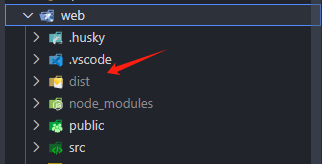

#### 详细目录结构
```
gaius-admin/
│
├── sql/                #数据库sql
├── web/                #前端代码
│   ├── src/            #源代码
│       ├── api/        #公共请求，如：字典、菜单
│       ├── assets/     #静态资源
│       ├── components/ #封装的组件
│       ├── directives/ # 封装的指令
│       ├── layout/     #布局组件
│       ├── model/      #类型定义
│       ├── router/     #路由
│       ├── stores/     #系统全局配置
│       ├── utils/      #封装的工具函数
│       └── views/      #页面   
│   ├── public/
│   └── package.json
│
└── server/                         #后端代码
│   ├── src/                        #源代码
│       ├── common/                 #公共服务、函数等 
│           ├── decorator/          #装饰器
│           ├── dto/                #公共dto
│           ├── enum/               #枚举类型方便使用
│           ├── filter/             #全局过滤器
│           ├── guards/             #守卫 
│           ├── interceptor/        #全局错误拦截
│           └── utils/              #公共方法
│       ├── config/                 #项目配置文件
│       └── modules/                #开发模块
│   ├── static/         #静态资源目录，可以通过服务器ip访问
│   └── package.json
└── package.json
```

#### 拉取项目
 本地拉取gaius-admin项目(`node v20`)
 ``` shell
    git clone https://github.com/Gaius-98/gaius-admin.git
 ```
 打包前端文件   
 ``` shell
    cd web 
    pnpm install 
    pnpm build
 ```
 打包完成后复制`dist`文件夹中的内容,如图：
 
#### 上传
将`dist`文件夹内容和`server`文件夹上传至云服务器

#### 部署
详细请参考[运维-部署](../opex/index.md)