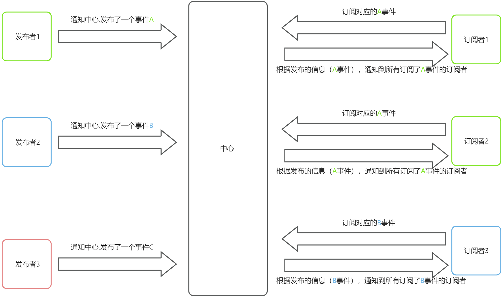

##### 概念
发布-订阅模式（Publish-Subscribe Pattern）是一种消息范式，其中存在一个代理中心（通常称为发布-订阅系统或消息队列），在该系统中，发布者发布消息，而订阅者订阅这些消息。发布者和订阅者之间没有直接的耦合关系，它们通过代理中心进行通信，通过解耦发布者和订阅者之间的关系，实现了组件之间的松耦合通信，提高了系统的灵活性和可扩展性。

就上图来看，订阅者1、2 订阅了事件A，当发布者发布事件A时，中心通过查找订阅者，并通知订阅者1和订阅者2。
##### 逻辑
实际开发过程中，我们经常接触发布-订阅模式，比如DOM的事件绑定、Vue的EventBus传递信息等。
让我们简单梳理一下逻辑：
首先，考虑中心存储的数据结构。因为我们需要处理多对多的关系，所以可以使用对象或者Map来存储关系。本次我们使用Map来存储关系。
```typescript
_subscribers:Map<string, Fn[]>;
```
接下来，订阅者需要订阅对应的事件。为此，我们必须提供两个参数：事件名称和中心在接收到事件后通知订阅者要执行的操作。
```typescript
//name就是事件名称,callback就是表示事件发生后要做的事情
onSubscribe:(name:string, callback:Fn)=>void
```
然后，发布者向中心发布一个事件。同样需要事件名称，当然还可以携带一些参数。
```typescript
//发布者发布一个事件，name是事件名称，其他的为参数。
onPublish:(name:string, ...args:any[])=>void;
```
最后，中心通知对应的订阅者，事件发生了，并告诉它们该做什么。同时，也将发布者发布时携带的参数发送给订阅者。
##### 实现
```typescript
class GuPubSub  {
  //事件中心
  _subscribers:Map<string, Fn[]>

  constructor() {
    this._subscribers = new Map()
  }
  //订阅事件
  onSubscribe(eventName:string, callback:Fn):void {
    let callbacks = this._subscribers.get(eventName) || []
    callbacks.push(callback)
    this._subscribers.set(eventName, callbacks)
  }
  //发布事件
  onPublish(eventName:string, ...args) {
    // 中心根据事件名称 查找对应的订阅事件，然后执行
    let callbacks = this._subscribers.get(eventName)
    if (callbacks) {
      callbacks.map(callback => callback(...args))
    }
  }
  //只订阅一次
  once(eventName:string, callback:Fn) {
    let onceFn = (...args) => { 
      callback(...args)
      this.unsubscribe(eventName, onceFn)
    }
    this.onPublish(eventName, onceFn)
  }
  //移除订阅
  unsubscribe(eventName:string, callback:Fn) {
    let callbacks = this._subscribers.get(eventName) || []
    this._subscribers.set(eventName, callbacks.filter(callbackItem => callbackItem !== callback))
  }
}
```
 	在上面的代码中，once函数用于订阅者只需要订阅一次事件的情况。通过执行该函数，在执行完回调后会自动移除对该事件的订阅。


