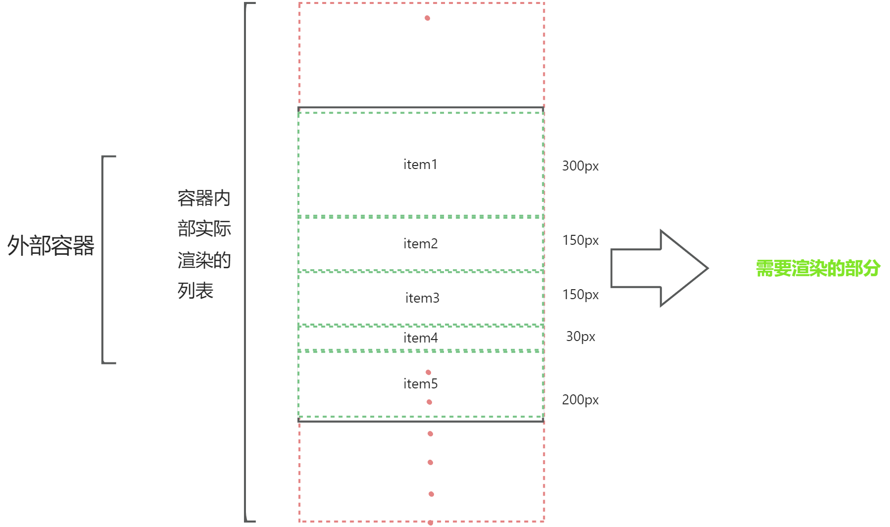
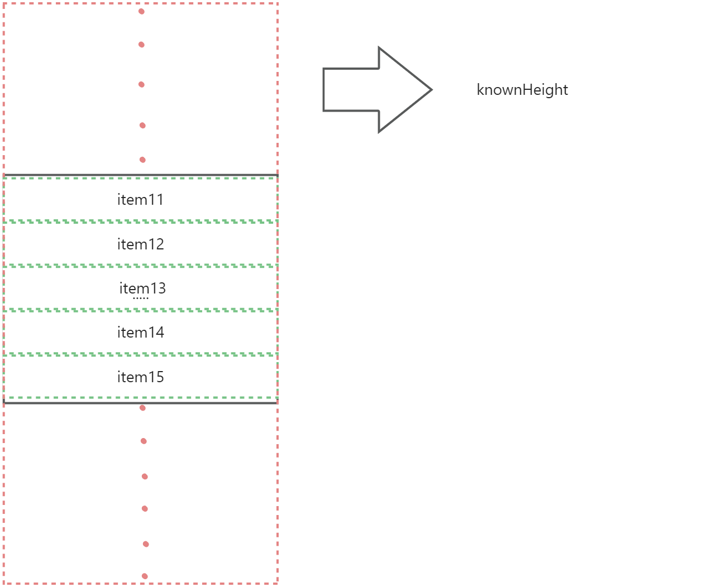
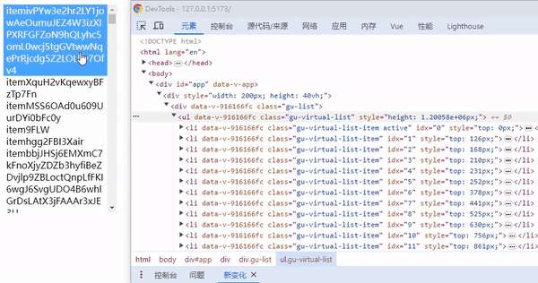

书接上文[实现一个简单的虚拟列表](./virtualList)，我们将介绍另一种虚拟列表的实现方法,。当列表中的子项高度无法确定时，无法使用之前的虚拟列表实现方式，因为需要动态获取子项的高度。

:::info
本次采用的是一种基于定位的方法来实现虚拟列表，不会改变列表容器的高度，而是通过将元素定位到对应位置来展示。
:::
由于无法确定每个子项的高度，在初次渲染时，我们可以预先设置一个高度（preHeight），并根据该高度计算要展示的列表项。此时，preHeight就相当于之前提到的itemHeight，我们可以计算出对应的startIndex和endIndex。但是需要注意的是，由于渲染时的DOM位置和宽高是错误的，所以在渲染完成后，我们需要进行修正。

由图可知，i项的top值就前i项的高度之和。
:::info
knownHeight = SUM(allHeight)
:::
##### 获取真实高度
在DOM渲染完成后，我们可以准确地获取到实际的DOM高度（dom.clientHeight）并将其记录在一个数组allHeightList中，数组中的每一项都对应列表中各项的实际高度。
:::info
由于需要在DOM绘制完成后才能获取实际高度，在Vue中我们可以使用onUpdated钩子函数来实现。
:::
计算`startIndex`和`endIndex`
现在，我们可以按照之前的计算方式来确定要展示的startIndex和endIndex。具体情况如下：

1. 滚动的距离在已知总高度内

如果起始索引到结束索引都小于已知总高度，我们可以精确计算出startIndex和endIndex。
当只有起始索引小于已知总高度时，对于剩余部分，我们可以使用preHeight进行模拟计算。
```typescript
let i = 0
let res = 0
while (res <= scrollTop.value) {
  res += allHeightList.value[i]
  i++
}
startIndex.value = i - 1
if (knownHeight.value - res >= height) {
  while (res <= scrollTop.value + height) {
    res += allHeightList.value[i]
    i++
  }
  endIndex.value = i
} else {
  endIndex.value = allHeightList.value.length + Math.ceil(height - (knownHeight.value - res) / preHeight.value)
}
```

2. 滚动距离超出已知总高度

 在这种情况下，我们无法准确计算startIndex和endIndex，只能通过preHeight进行模拟计算。
```typescript
startIndex.value = allHeightList.value.length
needShowLength.value = Math.ceil(height / preHeight.value)
endIndex.value = startIndex.value + needShowLength.value
```
下面让我们简单看一下使用该方法的效果（使用了4万条数据）
请注意，这种方法能够应对子项高度不确定的情况，但在处理超出已知总高度的滚动距离时稍显不足。


##### GuDynamicHeightList源码
```typescript
<template>
  <div
    ref="guList"
    class="gu-list"
    @scroll="onScroll"
  >
    <ul
      ref="virtualList" 
      class="gu-virtual-list"
      :style="{
        height:ListHeight + 'px'
      }"
    >
      <li
        v-for="(item,idx) in showList"
        :key="item[field.key]"
        class="gu-virtual-list-item"
        :class="[active == item[field.value] ? 'active' :'']"
        :style="{
          top:`${ reduceHeight(startIndex+idx) }px`
        }"
        :idx="idx"
        @click="onClick(item)"
      >
        <slot
          name="content"
          :item="item"
        >
          {{ item[field.label] }}
        </slot>
      </li>
    </ul>
  </div>
</template>
  
<script lang='ts' setup name="GuDynamicHeightList">
import { toRefs, ref, computed, onMounted, onUpdated } from 'vue'
import { Obj } from '../../types/utilsType'
  
export type ReplaceFieldType = {
  children?:string,
  value?:string,
  label?:string,
  key?:string,
  [field:string]:any
} 
interface VirtualProps {
  preHeight?:number,
  list:Obj[],
  replaceField?: ReplaceFieldType
}
const defaultField = {
  children: 'children',
  value: 'value',
  label: 'label',
  key: 'key',
}
const props = withDefaults(defineProps<VirtualProps>(), {
  preHeight: 26,
  list: () => ([]),
  replaceField: () => ({
    children: 'children',
    value: 'value',
    label: 'label',
    key: 'key',
  }),
})
const { list, replaceField: propField, preHeight } = toRefs(props)
// 所有项的真实高度
const allHeightList = ref<number[]>([])
const knownHeight = computed(() => allHeightList.value.reduce((p, c) => {
  p += c
  return p
}, 0))
// 总高度
const ListHeight = computed(() => {
  let idx = allHeightList.value.length
  return knownHeight.value + (list.value.length - idx) * preHeight.value
})
  
const field = computed(() => ({
  ...defaultField,
  ...propField.value,
}))
  
const active = ref('')
const emits = defineEmits(['onClickItem'])
const onClick = (item:Obj) => {
  active.value = item[field.value.value]
  emits('onClickItem', item)
}
// 展示列表data
const showList = ref<Obj[]>([])
const guList = ref()
// 裁剪数组开始项
const startIndex = ref(0)
// 裁剪数组结束项
const endIndex = ref(0)
// 计算需要展示的元素个数
const needShowLength = ref(0)
const virtualList = ref()
const scrollTop = ref(0)
const onScroll = () => {
  const { height } = guList.value.getBoundingClientRect()
  scrollTop.value = guList.value.scrollTop
  if (scrollTop.value + height > knownHeight.value) {
    startIndex.value = allHeightList.value.length
    needShowLength.value = Math.ceil(height / preHeight.value)
    endIndex.value = startIndex.value + needShowLength.value
  } else {
    let i = 0
    let res = 0
    while (res <= scrollTop.value) {
      res += allHeightList.value[i]
      i++
    }
    startIndex.value = i - 1
    if (knownHeight.value - res >= height) {
      while (res <= scrollTop.value + height) {
        res += allHeightList.value[i]
        i++
      }
      endIndex.value = i
    } else {
      endIndex.value = allHeightList.value.length + Math.ceil(height - (knownHeight.value - res) / preHeight.value)
    }
  }
  showList.value = list.value.slice(startIndex.value, endIndex.value)
}
const setAllHeight = () => {
  let nodes = document.querySelectorAll('.gu-virtual-list-item')
  for (let i = 0; i < nodes.length; i++) {
    let node = nodes[i]
    let idx = startIndex.value + Number(node.getAttribute('idx'))
    if (idx > allHeightList.value.length - 1) {
      allHeightList.value[idx] = node.clientHeight
    }
  }
}
const reduceHeight = (idx:number) => {
  if (allHeightList.value.length > idx) {
    return allHeightList.value.slice(0, idx).reduce((p, c) => {
      p += c
      return p
    }, 0)
  }
  return knownHeight.value + (idx - allHeightList.value.length) * preHeight.value
}
onMounted(() => {
  onScroll()
})
onUpdated(() => {
  setAllHeight()
})
</script>
<style scoped lang='scss'>
.gu-list{
  width: 100%;
  height: 100%;
  overflow-y:auto ;
  .gu-virtual-list{
    position: relative;
    padding: 0;
    margin: 0;
    .gu-virtual-list-item{
      position: absolute;
      list-style: none;
      cursor: pointer;
      padding: 0px 5px;
      word-break:break-all;
      left:0;
      &.active{
        background: rgba(24,144,255,.8);
        color: #fff;
      }
    }
  }
}
</style>

```


