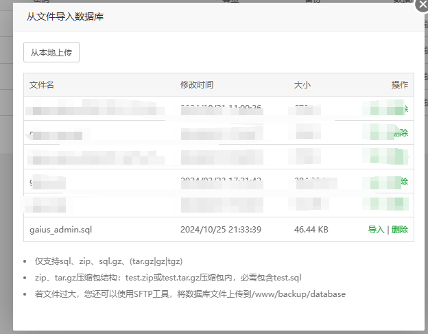
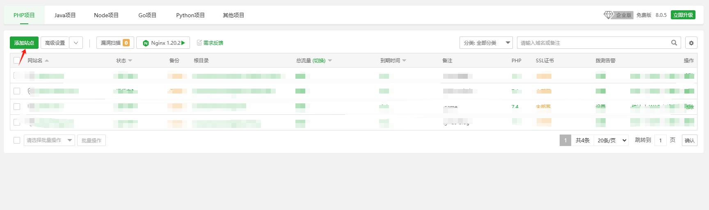
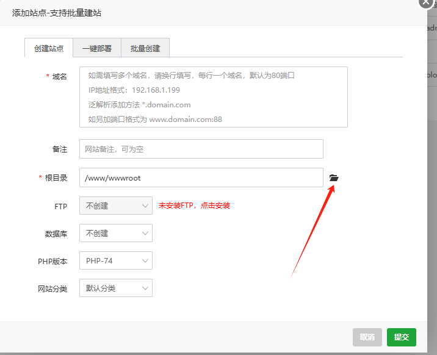
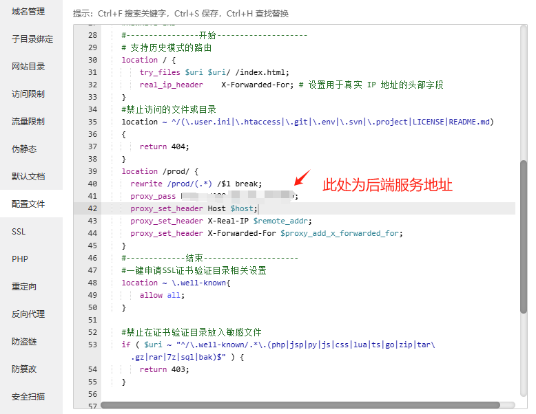
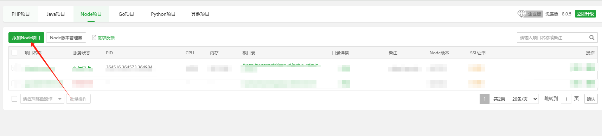
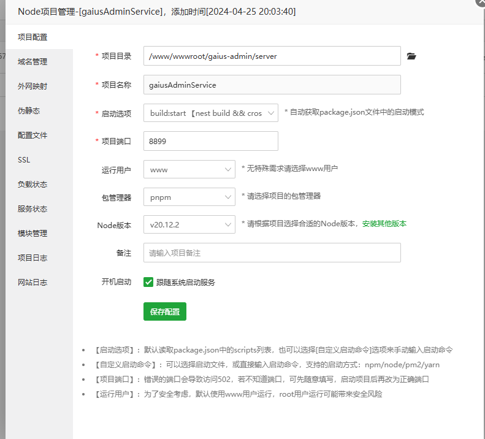

## 云服务器部署
### 前提
 作为一个前端，对于服务器的事情不是特别清楚，推荐使用`宝塔面板`
 [官方安装地址](https://www.bt.cn/new/index.html)
 宝塔面板安装完成后：
    1. 安装对应的开发软件（如：mysql，nginx等）
    2. 配置mysql数据库
    3. 宝塔面板`安全`添加对应的端口
    4. 云服务器白名单添加对应的端口
    5. 准备好前端打包文件`dist`文件夹，`server`后端Nest服务文件
### 上传
将`dist`文件夹内容和`server`文件夹上传至云服务器
### 开始部署项目
 #### 导入数据库
 ##### 1. 创建mysql数据库
 ##### 2. 上传项目中的`sql`文件夹中的sql
 ##### 3. 导入sql
 
 #### 添加站点
 ##### 1. 选择`网站`目录
 ##### 2. 添加站点
 
 ##### 3. 填写配置(选择上传的`dist`目录)
 
 ##### 4. 配置nginx代理
 
 下面是我使用的nginx配置，可以根据你自己的项目调整。
 ```
  #----------------开始--------------------
    # 支持历史模式的路由
    location / {
        try_files $uri $uri/ /index.html;
        real_ip_header    X-Forwarded-For; # 设置用于真实 IP 地址的头部字段
    }
    #禁止访问的文件或目录
    location ~ ^/(\.user.ini|\.htaccess|\.git|\.env|\.svn|\.project|LICENSE|README.md)
    {
        return 404;
    }
    location /prod/ {
      rewrite /prod/(.*) /$1 break;
      proxy_pass http://120.26.161.36:8899;
      proxy_set_header Host $host;
      proxy_set_header X-Real-IP $remote_addr;
      proxy_set_header X-Forwarded-For $proxy_add_x_forwarded_for;
    }
    #-------------结束---------------------
 ```
 #### 添加Node项目
 ##### 1. 添加Node项目
 ##### 
 ##### 2. 修改`server/src/config/prod.yml`中的mysql配置
 ##### 3. 填写配置
 
 ##### 4. 一键安装模块
 ##### 5. 启动项目
 #### 部署完成
 安装上述步骤，完成部署后，访问对应的前端页面。
 