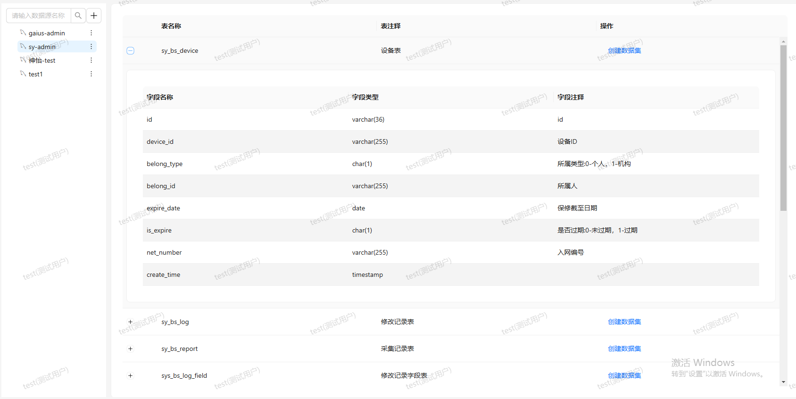
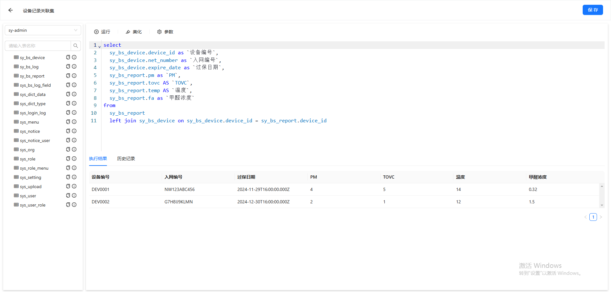
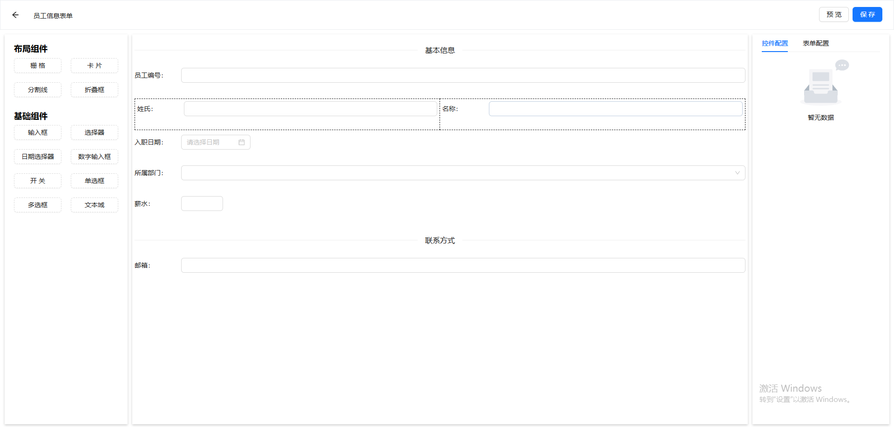
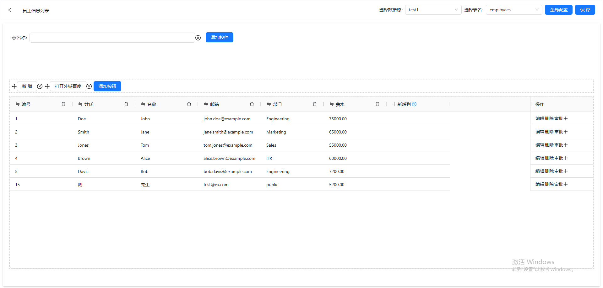
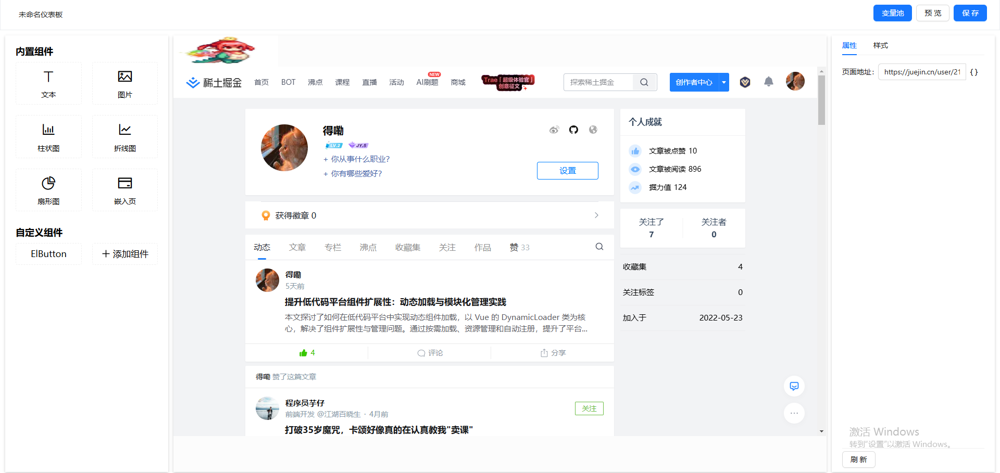

# QuickBuild 低代码开发平台

 

## 🌟 项目概述

QuickBuild 是一款基于现代Web技术栈构建的低代码开发平台，旨在通过可视化配置方式快速构建企业级应用。平台整合了数据源管理、表单设计、列表配置、仪表板展示等核心功能模块，显著降低开发门槛，提升开发效率。

## 🛠️ 技术栈
- **前端框架**: Vue3 + Vite
- **后端框架**: NestJS
- **数据库**: MySQL
- **核心特性**: 组件化开发 + 可视化配置

## 🚀 核心功能模块

### 1. 数据源管理
- 支持第三方数据源接入（当前已实现MySQL）
- 统一数据源配置管理
- 提供连接测试与验证功能

### 2. 数据集管理
- 可视化数据源选择
- SQL查询构建器
- 数据结果集预览

### 3. 表单设计器
- 拖拽式组件布局
- 可视化属性配置
- 数据绑定功能

### 4. 列表设计器
- 数据源快速绑定
- 列配置可视化
- 操作按钮工作流集成
- 支持分页与筛选配置

### 5. 仪表板设计器（开发中）
- 自由布局拖拽
- 多类型图表支持
- 动态第三方库加载
- 可视化数据绑定

## 🔍 项目特点
- **模块化架构**: 各功能模块独立解耦，支持灵活扩展
- **可视化开发**: 通过拖拽配置降低编码需求
- **企业级扩展**: 支持工作流集成和第三方扩展

## 📦 快速体验
- **在线演示**: [http://120.26.161.36:9090/](http://120.26.161.36:9090/)
- **源码仓库**: [https://github.com/Gaius-98/QuickBuildWeb](https://github.com/Gaius-98/QuickBuildWeb)

🚧 开发计划

完善仪表板设计器功能

仪表板实现自定义尺寸功能方案

欢迎提交Issue和PR参与项目共建！💡

