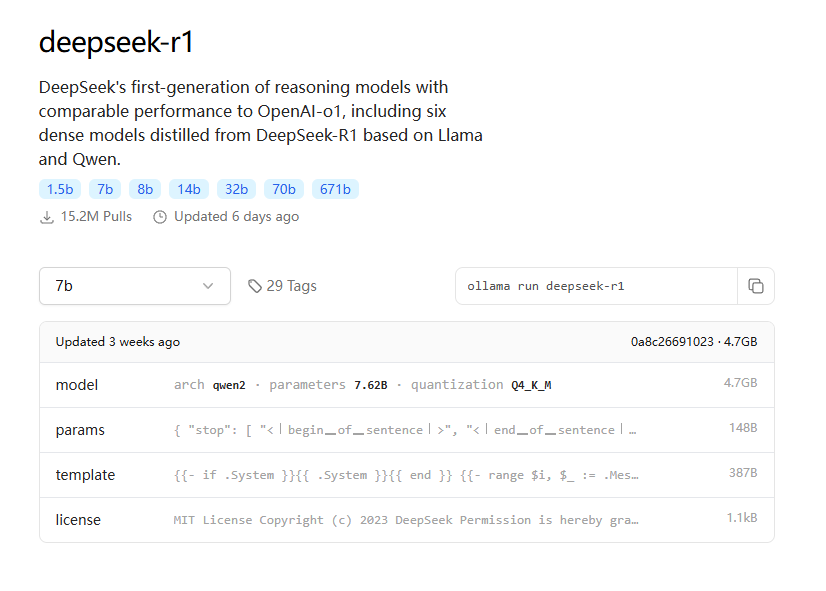
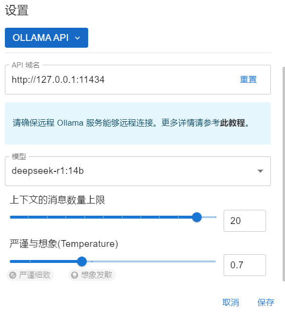
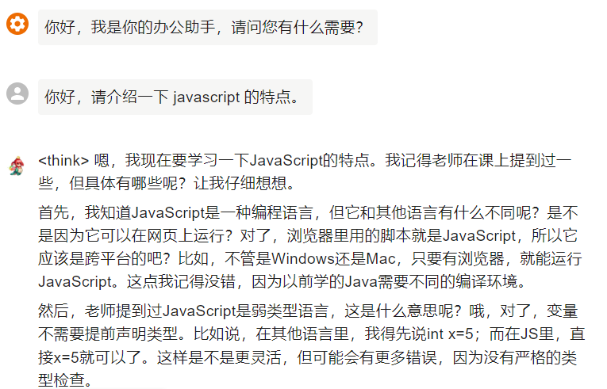
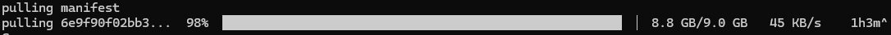

### 引言
在人工智能飞速发展的今天，大型语言模型（LLM）已成为技术领域的核心工具。然而，依赖云端服务可能存在隐私泄露、网络延迟等问题。本地部署大模型既能保障数据安全，又能实现离线高效推理。本文将手把手教你通过 Ollama 框架在本地部署 DeepSeek 大模型，并搭配 ChatBox 桌面客户端实现可视化交互，全程无需复杂代码！

### 一、准备工作
**1.硬件要求**

内存：建议 ≥ 16GB（7B 模型需 8GB 以上，更大模型需更高配置）。

存储：至少 20GB 可用空间（模型文件通常为 5GB~20GB）。

操作系统：支持 Windows / macOS / Linux。

**2.实验机配置**

处理器：Intel i5-12490F

显卡：AMD Radeon RX 7800 XT

内存：32GB

存储：1TB SSD

操作系统：Windows 11

**3.软件依赖**

安装 Ollama：跨平台的大模型本地化工具。

下载 ChatBox：开源的 AI 桌面客户端，支持 Ollama 连接。

### 二、安装 Ollama 并部署 DeepSeek 模型
##### 步骤 1：安装 Ollama
Windows/macOS：直接[下载安装包](https://github.com/ollama/ollama/releases)，双击运行。

Linux：一行命令快速安装：

```bash
curl -fsSL https://ollama.ai/install.sh | sh
```
##### 步骤 2：拉取 DeepSeek 模型
Ollama 官方模型库已集成多版本 DeepSeek 模型（需确认模型名称）：


```bash

# 示例：拉取 DeepSeek R1 14B 版本（具体名称以官方仓库为准）
ollama pull deepseek-r1:14b

# 若模型未官方支持，可手动加载 GGUF 格式模型（需提前转换）
ollama create deepseek-custom -f ./Modelfile
```
步骤 3：运行模型
```bash
ollama run deepseek-r1:14b
```
首次运行：Ollama 会自动下载模型并加载到内存。

验证部署：输入简单问题测试响应，例如：

```text

>>> 你好，请介绍一下 javascript 的特点。
```

### 三、使用 ChatBox 实现可视化交互
ChatBox 提供类似 ChatGPT 的友好界面，支持多会话管理和历史记录。

##### 步骤 1：安装 ChatBox
前往 GitHub Release 页面，[下载](https://github.com/Bin-Huang/chatbox/releases)对应系统的安装包。

##### 步骤 2：配置 Ollama 连接
打开 ChatBox，进入 设置 → 模型设置。

在 API 地址 中输入 Ollama 服务地址：```http://localhost:11434。```

选择已下载的模型 **deepseek-r1:14b**。

##### 步骤 3：开始对话
输入问题（支持 Markdown 和代码块）：

### 四、常见问题解决
**1.模型下载失败**

方案：检查网络连接，尝试更换镜像源或使用代理。
当下载速度突然变慢时，可以尝试终止当前下载，重新下载。因为有数据缓存会接着继续下载。


**2.推理速度慢**

方案：关闭其他占用内存的软件，或升级硬件配置。

### 五、总结
通过 Ollama + ChatBox 组合，即使非技术用户也能轻松在本地部署和体验大模型。DeepSeek 的高效推理能力结合 ChatBox 的直观交互，为学习、开发甚至内容创作提供了强大支持。

#### 参考链接

[Ollama 官方文档](https://github.com/ollama/ollama)

[ChatBox GitHub 仓库](https://github.com/Bin-Huang/chatbox)

[DeepSeek](https://www.deepseek.com/)

立即动手，打造你的私人 AI 助手吧！ 🚀